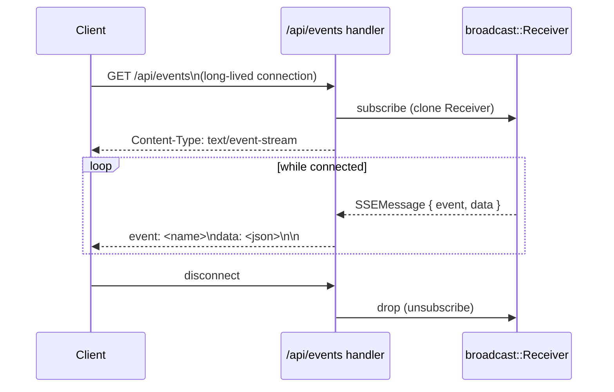
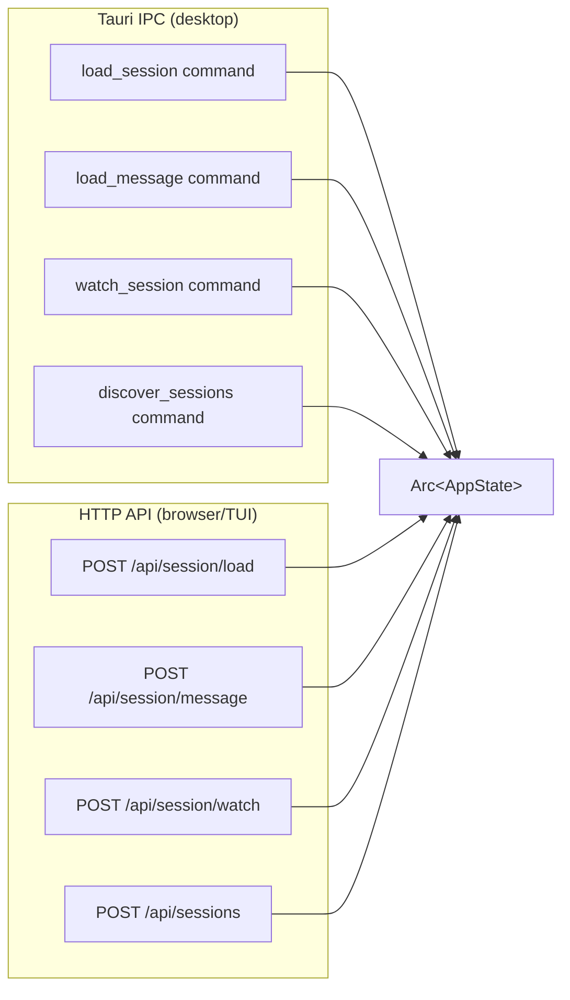

# Spec: HTTP API & SSE

**Location**: `src-tauri/src/http_api.rs`

The Rust backend exposes a full HTTP API so that browsers and the TUI can access the same
functionality as the Tauri desktop frontend. The server runs on port **11423** by default
(configurable via `CCTRACE_HTTP_PORT`).

---

## Architecture

```mermaid
graph TB
    subgraph Rust["Rust Backend (Axum)"]
        ROUTER["Axum Router\n/api/*"]
        MW["Middleware\nclient credential check (accepted clients only)\nCORS (allowlisted origins)\nJSON responses"]
        STATE["Arc&lt;AppState&gt;"]
    end

    subgraph Endpoints["REST Endpoints"]
        GET_SETTINGS["GET /api/settings"]
        GET_DIRS["GET /api/project-dirs"]
        POST_SESSIONS["POST /api/sessions"]
        POST_LOAD["POST /api/session/load"]
        POST_MESSAGE["POST /api/session/message"]
        GET_META["GET /api/session/meta"]
        POST_WATCH["POST /api/session/watch"]
        POST_UNWATCH["POST /api/session/unwatch"]
        POST_PICKER_WATCH["POST /api/picker/watch"]
        POST_PICKER_UNWATCH["POST /api/picker/unwatch"]
        GET_GIT["GET /api/git-info"]
        GET_DEBUG["GET /api/debug-log"]
        GET_SETTINGS_W["POST /api/settings/set"]
        CLIENTS["GET|POST /api/clients\nPOST /api/clients/{id}/reissue|revoke\nGET /api/whoami"]
        GET_SSE["GET /api/events\n(SSE stream)"]
        STATIC["GET /*\n(optional static assets)"]
    end

    ROUTER --> MW --> STATE
    ROUTER --> GET_SETTINGS
    ROUTER --> GET_DIRS
    ROUTER --> POST_SESSIONS
    ROUTER --> POST_LOAD
    ROUTER --> POST_MESSAGE
    ROUTER --> GET_META
    ROUTER --> POST_WATCH
    ROUTER --> POST_UNWATCH
    ROUTER --> POST_PICKER_WATCH
    ROUTER --> POST_PICKER_UNWATCH
    ROUTER --> GET_GIT
    ROUTER --> GET_DEBUG
    ROUTER --> GET_SETTINGS_W
    ROUTER --> CLIENTS
    ROUTER --> GET_SSE
    ROUTER --> STATIC
```



---

## Endpoint Reference

### `GET /api/settings`

Returns current settings, the platform default projects directory, and the client verification
state (see [Authentication](#authentication)).

**Response**

```json
{
  "projects_dir": "/Users/you/.claude/projects",
  "default_dir": "/Users/you/.claude/projects",
  "api_auth_enabled": true,
  "api_auth_source": "file",
  "clients": [
    {
      "id": "6f1d…",
      "name": "web-ui",
      "builtin": true,
      "created_at": 1757100000,
      "issued_at": 1757100000
    },
    {
      "id": "a2c4…",
      "name": "tui",
      "builtin": true,
      "created_at": 1757100000,
      "issued_at": 1757100000
    },
    {
      "id": "9b7e…",
      "name": "ci-script",
      "builtin": false,
      "created_at": 1757103600,
      "issued_at": 1757103600,
      "revoked_at": 1757110000
    }
  ]
}
```

`api_auth_source` is `"file"` (signing key persisted in `api-secret`), `"ephemeral"` (the config dir
was unusable at startup, so the key lives in memory and every credential dies with the process) or
`"disabled"` (`CCTRACE_API_AUTH=off`). `clients` lists the registered clients — never their
credentials.

---

### `GET /api/project-dirs`

Returns all project directories found under `projects_dir`.

**Response**

```json
{ "dirs": ["/Users/you/.claude/projects/my-app"] }
```

---

### `POST /api/sessions`

Discovers sessions across provided project directories.

**Request**

```json
{ "dirs": ["/Users/you/.claude/projects/my-app"] }
```

**Response**

```json
{
  "sessions": [
    {
      "path": "...",
      "session_id": "abc123",
      "first_message": "Write a function...",
      "mod_time": "2025-05-01T10:00:00Z",
      "total_tokens": 12345,
      "cost_usd": 0.05,
      "model": "claude-opus-4-6",
      "turn_count": 12,
      "git_branch": "main",
      "is_ongoing": false
    }
  ]
}
```

Results are cached for 2 seconds (see [03-state-management.md](03-state-management.md)).

---

### `POST /api/session/load`

Fully parses a session JSONL file and returns a windowed slice of display-ready messages,
plus a lightweight full-session index so virtualized clients can size and scroll the list
without holding every message's heavy body in memory.

**Request**

```json
{ "path": "/path/to/session.jsonl", "start": 0, "limit": 200 }
```

`start`/`limit` are optional and request an index window into the message list — `start`
defaults to `0`, `limit` defaults to unset (load to the end). Omit both to load the whole
session.

**Response**

```json
{
  "messages": [/* DisplayMessage[] — only the requested window */],
  "count": 5000,
  "start": 0,
  "roles": ["user", "assistant", "..."],
  "context_tokens": 12345,
  "teams": [/* TeamSnapshot[] */],
  "ongoing": true,
  "meta": { "cwd": "...", "git_branch": "main", "permission_mode": "manual" },
  "session_totals": { "total_tokens": 5000, "cost_usd": 0.02, "model": "..." }
}
```

- `messages` — the windowed slice only, not the whole session.
- `count` — total number of messages in the full session.
- `start` — the index of the first message in the returned `messages` slice.
- `roles` — the role of every message in the full session (length == `count`); lets a
  virtualized client render placeholders and drive expand-all without holding the heavy
  message bodies for rows outside the window.
- `context_tokens` — latest Claude context-window fill, for the context gauge.

---

### `POST /api/session/message`

Returns the single full (heavy-body) `DisplayMessage` at `index`, for the Detail view to
fetch on demand — the windowed list from `session/load` carries lightened messages with no
tool-output bodies, so the detail view fetches the full message separately when the user
opens it.

**Request**

```json
{ "path": "/path/to/session.jsonl", "index": 42 }
```

**Response**

```json
/* DisplayMessage, or null if index is out of range */
```

---

### `POST /api/session/watch` / `POST /api/session/unwatch`

Starts or stops the session watcher. The watcher pushes `session-update` events over SSE.

**Watch request**: `{ "path": "..." }`
**Both responses**: `{ "ok": true }`

---

### `POST /api/picker/watch` / `POST /api/picker/unwatch`

Starts or stops the picker watcher. Pushes `picker-refresh` events over SSE.

**Watch request**: `{ "dirs": ["..."] }`
**Both responses**: `{ "ok": true }`

---

### `GET /api/git-info`

Returns git metadata for a working directory.

**Query params**: `?cwd=/path/to/dir`

**Response**

```json
{
  "branch": "main",
  "dirty": false,
  "worktree_dirs": ["/path/to/worktree"]
}
```

---

### `GET /api/debug-log`

Returns incremental debug log entries.

**Query params**: `?session_path=...&since=<timestamp>&level=warn`

**Response**

```json
{
  "entries": [
    {
      "timestamp": "...",
      "level": "Warn",
      "category": "hook",
      "message": "..."
    }
  ]
}
```

---

### `POST /api/settings/set`

Updates the projects directory setting.

**Request**: `{ "projects_dir": "/custom/path" }`
**Response**: `{ "ok": true }`

---

### `GET /api/clients`

The accepted clients, as in `GET /api/settings`'s `clients` (see
[Authentication](#authentication)). Credentials are never returned.

### `POST /api/clients`

**Request**: `{ "name": "ci-script" }` — trimmed, 1–64 characters, unique (case-insensitively).

**Response**: `{ "client": { ...Client }, "credential": "eyJ…" }`. The credential is returned
**exactly once**; the backend does not store it. `400 {"error": ...}` for an invalid or duplicate
name, or when verification is disabled.

### `POST /api/clients/{id}/reissue`

Mints a new credential for the client and bumps its `issued_at`, so every credential minted earlier
stops working; also un-revokes it. Response as for `POST /api/clients`. For the built-in clients the
backend rewrites `clients/<name>.jwt` so the TUI and the Vite dev server follow; when the client is
`web-ui` the response also carries `Set-Cookie: cctrace_token=<new>` so a same-origin (Docker) tab
keeps working without a reload.

### `POST /api/clients/{id}/revoke`

Marks the client revoked: every credential it holds is rejected immediately. Idempotent. Response:
the updated `Client`. Revoking a built-in client also deletes its `clients/<name>.jwt`.

### `GET /api/whoami`

`{ "auth_enabled": true, "client": { "id": "…", "name": "tui" } }` — the identity the middleware
attached to this request. With `CCTRACE_API_AUTH=off`, `auth_enabled` is `false` and `client` is
`null`.

### `GET /api/events` — SSE Stream

The SSE endpoint streams real-time events to connected clients.



#### Event Types

| Event name       | Payload                | Trigger                                  |
| ---------------- | ---------------------- | ---------------------------------------- |
| `session-update` | `SessionUpdatePayload` | Session JSONL changed                    |
| `picker-refresh` | `{}` (empty)           | Any `.jsonl` file in project dir changed |

#### `session-update` Payload

A lightweight refresh **signal**, not a data dump: it carries the total
message `count` and the per-message `roles` index (so a virtualized client
can resize its list and refetch the visible window) plus session-level
fields, but never the heavy message bodies. Clients re-fetch the window
they're viewing (`SessionUpdatePayload` in `src-tauri/src/watcher.rs`).

```json
{
  "count": 42,
  "roles": [ /* string[], one per message, length == count */ ],
  "context_tokens": 12345,
  "teams": [ /* TeamSnapshot[] */ ],
  "ongoing": true,
  "permission_mode": "manual",
  "session_totals": { "total_tokens": ..., "cost_usd": ..., "model": "..." }
}
```

There is no `messages` field. The web frontend re-fetches its current
window via `POST /api/session/load` on receipt. The TUI (`tui-py/app.py`'s
`_on_session_update`) does the same — it re-fetches the whole session via
`load_session` rather than reading this payload, since it doesn't paginate
the way the web frontend does.

---

## Configuration

| Env var                   | Default                  | Description                                                                                                                                                        |
| ------------------------- | ------------------------ | ------------------------------------------------------------------------------------------------------------------------------------------------------------------ |
| `CCTRACE_HTTP_HOST`       | `127.0.0.1`              | Bind address                                                                                                                                                       |
| `CCTRACE_HTTP_PORT`       | `11423` (Docker: `1421`) | Listen port                                                                                                                                                        |
| `CCTRACE_STATIC_DIR`      | (unset)                  | Directory to serve as static files at `/`                                                                                                                          |
| `CCTRACE_ALLOWED_ORIGINS` | (unset)                  | Extra CORS origins, comma-separated (see CORS Policy below)                                                                                                        |
| `CCTRACE_API_AUTH`        | (unset)                  | `off` disables client verification entirely (loud stderr warning)                                                                                                  |
| `CCTRACE_CONFIG_DIR`      | (unset)                  | Relocates the config dir holding `settings.json`, `api-secret`, `clients.json` and `clients/` (default `<OS config dir>/claude-code-trace`; used by the e2e suite) |

The default port for native binaries is `11423` (defined in `http_api.rs:38` as
`DEFAULT_HTTP_PORT`). The Docker image overrides this to `1421` via `CCTRACE_HTTP_PORT=1421` so
that the API and the bundled static frontend are served from a single, well-known port — this is
what the README and `docker-compose.yml` reference.

When `CCTRACE_STATIC_DIR` is set, the frontend build output is served directly, enabling the pure
headless / Docker deployment mode.

---

## Tauri IPC Mirror

Every HTTP endpoint has an exact Tauri command counterpart in `src-tauri/src/commands/`.
The commands share the same `AppState` and call the same parser functions.



---

## Authentication

**Location**: `src-tauri/src/auth.rs` (middleware, key, cookie), `src-tauri/src/clients.rs`
(registry), `src-tauri/src/jwt.rs` (HS256), `src-tauri/src/commands/clients.rs` (management).

Every `/api/*` route requires the signed credential of a registered, non-revoked **client**, so the
backend knows _who_ is calling and can cut any one client off without touching the others. Without
it, any local process (or, when Docker binds `0.0.0.0`, any LAN host) could read session
transcripts, rewrite `settings.json`, add CORS origins, or trigger the `git` / `osascript` side
effects of `/api/git-info` and `/api/focus`. The Tauri desktop webview is unaffected: it talks over
IPC, never HTTP.

### Model

- A **client** is `{ id: uuid, name, builtin, created_at, issued_at, revoked_at? }`, kept in
  `<config root>/clients.json`. Two are **built in** and registered on first start: `web-ui` (the
  browser frontend) and `tui`. Users register more from Settings → **Accepted clients** or
  `POST /api/clients`.
- A **credential** is an HS256 JWT (`{"alg":"HS256","typ":"JWT"}`) with claims
  `{ sub: <client id>, name, iat }` and **no expiry**. It is valid iff the signature verifies under
  the server key **and** `sub` is a registered, non-revoked client **and** `iat >= client.issued_at`.
- **Reissue** bumps `issued_at` (strictly, even within the same second), so every credential minted
  before it dies while nobody else's changes. **Revoke** rejects the client outright; reissue
  un-revokes.
- The **signing key** is 32 random bytes in `<config root>/api-secret`, created once with `O_EXCL`
  and mode `0600`, never rotated by the UI (rotating it would invalidate every client at once —
  delete the file and restart to do that deliberately).
- Built-in clients' credentials are written to `<config root>/clients/<name>.jwt` (`0600`) so the
  Vite dev server (`web-ui`) and the TUI (`tui`) can read them; they are rewritten on reissue and
  removed on revoke. User-registered clients are shown their credential **once** and it is never
  stored — the backend only ever needs the key to verify.

Config root per OS: `$XDG_CONFIG_HOME` or `~/.config` (Linux), `~/Library/Application Support`
(macOS), `%APPDATA%` (Windows), each `/claude-code-trace`; `CCTRACE_CONFIG_DIR` overrides it. The JWT
code is a deliberately small implementation over `hmac` + `sha2` with a constant-time MAC compare;
any `alg` other than `HS256` (including `none`) is rejected before the payload is decoded.

### Startup (`auth::resolve_auth`)

1. `CCTRACE_API_AUTH=off` → verification **disabled**; a warning is printed to stderr. No identity
   is attached to requests and client management is refused.
2. Otherwise load or create `api-secret`, load `clients.json` (a corrupt file is an error, not a
   silent reset), add any missing built-in client, and (re)write `clients/web-ui.jwt` /
   `clients/tui.jwt` when missing or no longer valid under the current key and `issued_at`.
3. If the config dir cannot be used the server fails **closed**: it runs with an in-memory key
   (`api_auth_source: "ephemeral"`), the built-ins are registered in memory, and Settings explains
   that credentials issued now die with the process and the TUI cannot read its own.

`AppState` holds `auth: RwLock<AuthMode>`, `clients: RwLock<ClientRegistry>` and the live `web-ui`
credential. All writes (`clients.json`, `clients/*.jwt`) go through a sibling temp file and a rename,
so concurrent readers never see them empty. When a verified credential names a client the in-memory
registry does not accept (unknown id or stale `iat`), the middleware re-reads `clients.json` once
before rejecting: if another cctrace process sharing the config dir (a background `--web` service
next to the desktop app, say) registered or reissued that client, the live registry heals on the spot
instead of the client getting 401 until a restart.

### Accepted carriers (`auth::require_client`)

Checked in this order; the first credential that verifies **and** maps to a live client wins:

| Carrier                              | Used by                                                     |
| ------------------------------------ | ----------------------------------------------------------- |
| `X-CCTrace-Token: <credential>`      | Web UI `fetch` (`src/lib/invoke.ts`), TUI (`tui-py/api.py`) |
| `Authorization: Bearer <credential>` | curl / external tools                                       |
| `?token=<credential>` query          | Browser `EventSource` on `/api/events` (cannot set headers) |
| `cctrace_token` cookie               | Docker same-origin UI (set by the server, see below)        |

On success the caller's `ClientIdentity { id, name }` is attached to the request (`GET /api/whoami`
returns it). Otherwise `401 {"error": "invalid or revoked client credential — ..."}`. `OPTIONS`
always passes so CORS preflights are never blocked, and CORS runs outermost so the 401 carries CORS
headers and the browser can read the error body. The middleware is applied with `route_layer`, so it
covers only the registered API routes: the static UI fallback stays public and unknown paths still 404
rather than 401.

### How each client gets its credential

- **Web/dev mode** (`cctrace --web`, Vite on 1420 → API on 11423): the `cctrace-api-token` Vite
  plugin in `vite.config.ts` reads `clients/web-ui.jwt` (read-only — `bin/api-token.mjs`; the plugin
  never creates anything, only the backend holds the key) and serves it as the virtual module
  `virtual:cctrace-api-token` — `""` in production builds, so a bundle never contains a credential,
  and `""` until the backend has written the file on a first run. `src/lib/apiToken.ts` imports it;
  `invoke.ts` sends the header and `listen.ts` appends `?token=`. When the file appears or changes on
  disk (Reissue `web-ui` from this tab, another tab, the desktop app or any other client) the plugin
  invalidates the module and pushes it over HMR; `apiToken.ts` accepts the update and every open tab
  adopts the new credential in place — no dev-server restart and no page reload (a restart would make
  Vite's client full-reload the page and tear down the Settings modal the user just clicked in).
- **Docker / same-origin** (`CCTRACE_STATIC_DIR` set): `auth::attach_credential_cookie` wraps the
  static fallback and adds `Set-Cookie: cctrace_token=<web-ui credential>; Path=/; HttpOnly;
SameSite=Strict` to `text/html` responses — but **only when the request `Host` is allowlisted**:
  `localhost`, `127.0.0.1`, `::1`, or the host part of any allowed CORS origin (defaults,
  `CCTRACE_ALLOWED_ORIGINS`, Settings UI). Without that gate a DNS-rebinding page pointed at the
  `0.0.0.0`-bound port would be issued the cookie and become a fully authenticated client. Reaching a
  container via a LAN IP or reverse-proxy hostname therefore requires adding it to
  `CCTRACE_ALLOWED_ORIGINS` (or registering a client and passing its credential explicitly). No cookie
  is issued while `web-ui` is revoked, so revoking it locks every browser out until another client
  (the desktop app, the TUI's credential, a script) reissues it.
- **TUI**: `tui-py/auth.py` reads `clients/tui.jwt` (never creates it) and `auth_headers()` is
  re-evaluated per request and per SSE (re)connect, so a reissued `tui` credential is picked up
  without a restart. A 401 surfaces as `api.ApiAuthError` naming the file and the Settings section.
- **Other tools**: register a client in Settings → **Accepted clients** (or `POST /api/clients` as an
  existing client), copy the credential when it is shown, and send it:
  `curl -H "X-CCTrace-Token: $CRED" http://127.0.0.1:11423/api/whoami`. To script against a fresh
  install, the TUI's own file works as a bootstrap:
  `curl -H "X-CCTrace-Token: $(cat ~/.config/claude-code-trace/clients/tui.jwt)" ...`.

### Settings UI

`GET /api/settings` reports `api_auth_enabled`, `api_auth_source` (`"file" | "ephemeral" |
"disabled"`) and `clients`. The Settings modal's **Accepted clients** section lists them (name,
built-in badge, since, Active/Revoked) with **Reissue** and **Revoke** per row — both two-click
confirms; arming Revoke on `web-ui` from a browser warns that it locks this UI out — and an **Add
client** row that shows the new credential once with Copy. Reissuing `web-ui` from a browser keeps
that tab working: it swaps the live credential in memory (same-origin tabs also get the new cookie
from the response; dev tabs get it again over HMR). The Tauri commands `list_clients`,
`register_client`, `reissue_client`, `revoke_client` mirror the HTTP routes.

Both deployment shapes are exercised end-to-end by the Playwright suite (`npm run test:e2e`,
`playwright.config.ts`, `e2e/`): a real headless backend plus the real UI in Chromium, once served
same-origin from a built bundle (cookie path, `Host` gate, live SSE, register/reissue/revoke, web-ui
reissue and revoke) and once from the Vite dev server cross-origin (header + query carriers, plugin
serving the backend-written credential, HMR hot-swap on reissue from the tab and from another
client). It runs against `CCTRACE_CONFIG_DIR=e2e/.tmp/...` and asserts every secret (`api-secret`,
`clients.json`, `clients/*.jwt`) stayed on that path.

Note: in dev mode the SSE credential travels in the URL. The server keeps no access log today; if one
is added, the `token` query parameter must be redacted.

---

## CORS Policy

The HTTP server checks every request's `Origin` header against an allowlist — never a wildcard.
An origin is allowed only if it exactly matches one of (`http_api.rs::origin_allowed`):

- The built-in dev/web UI defaults: `http://localhost:1420`, `http://127.0.0.1:1420`
  (`DEFAULT_ALLOWED_ORIGINS`).
- Extra origins from the `CCTRACE_ALLOWED_ORIGINS` env var (comma-separated), resolved once at
  server startup.
- Extra origins configured via the Settings UI (`Settings.allowed_origins`, set through
  `POST /api/settings/origins`), checked live on every request — no restart required for a change
  to take effect.

The env var and the Settings-UI list are unioned, not exclusive — either or both can be used. The
env var is the better fit for Docker/deployment (where `settings.json` may not survive a container
restart without a volume mount); the Settings-UI field is for desktop/persistent-web use. Matching
is exact-string only — no prefix, substring, or wildcard matching.

The Tauri desktop webview never goes through this check — it talks to the backend over the IPC
bridge, not HTTP. The Docker image doesn't need an allowlist entry either — it serves the frontend
and API on the same origin (`CCTRACE_STATIC_DIR`), so browser requests there are same-origin and
CORS doesn't apply.

---

## Related Specs

- [03-state-management.md](03-state-management.md) — AppState used by every handler
- [05-frontend-web.md](05-frontend-web.md) — browser client using this API
- [06-tui.md](06-tui.md) — TUI client using this API
- [08-session-lifecycle.md](08-session-lifecycle.md) — SSE flow end-to-end
