# Spec: Web Frontend

**Locations**: `src/`, `shared/`

The web frontend is a React 18 app built with Vite. It runs inside the Tauri WebView for the
desktop mode, or as a standalone browser page served by the Rust HTTP backend.

All data comes from either Tauri IPC (`invoke`) or HTTP REST+SSE (`fetch`/`EventSource`),
selected at runtime by `src/lib/isTauri.ts`.

---

## Component Hierarchy

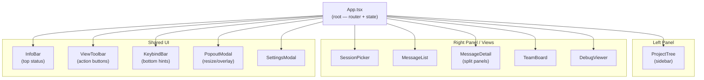

---

## View State Machine

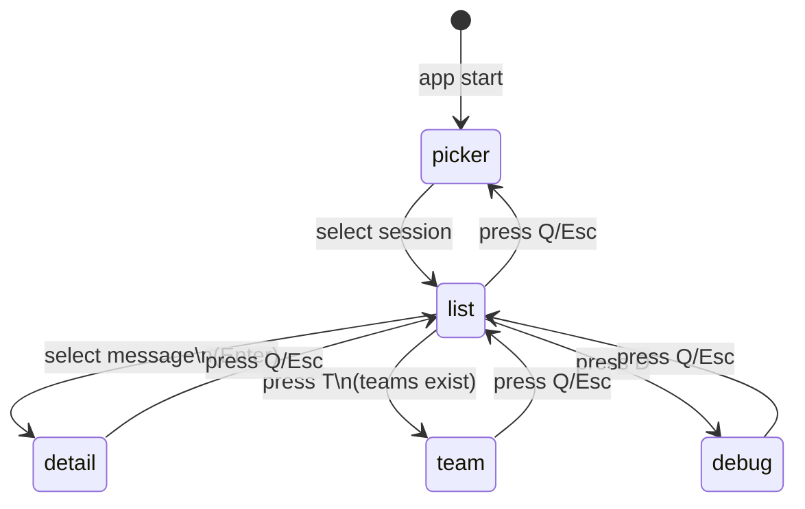

---

## Hook Architecture

### `useSession` — Session State

Manages the full lifecycle of a loaded session: paginated loading, live updates, teams, metadata.
Messages are never held in full — the hook keeps a sparse, page-based window of message bodies
plus a lightweight session-wide index, so memory stays flat regardless of session size.

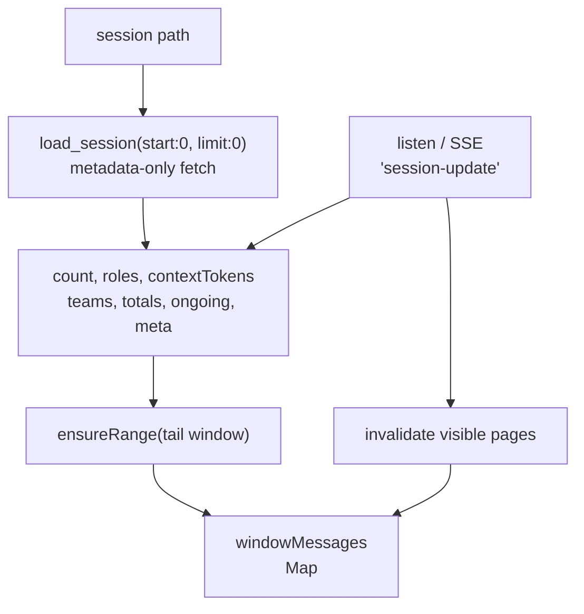

Session-level state (`count`, `roles`, `contextTokens`, `teams`, `ongoing`, `meta`,
`sessionTotals`) is tracked separately from the message bodies themselves:

- `roles: string[]` is a role-per-message index covering the **whole session** (length ===
  `count`), fetched cheaply up front so the list can render placeholders and drive
  expand/collapse-all before any bodies are loaded.
- `windowMessages: Map<number, DisplayMessage>` is a sparse store of only the message bodies
  currently loaded, keyed by absolute index.

Paging model:

- `PAGE_SIZE = 100` — messages are fetched from the backend a page at a time via
  `invoke("load_session", { path, start, limit })`.
- `ensureRange(start, end)` is called by `MessageList` (via Virtuoso's `rangeChanged`) whenever
  the visible window changes. It computes the pages spanning `[start, end)`, fetches any that
  aren't already loaded or in flight, and merges results into `windowMessages`.
- `evictOutsideKeepBand(keepFirstPage, keepLastPage)` drops pages outside a keep band of
  `KEEP_MARGIN_PAGES = 1` pages beyond the requested range. **It runs on every `ensureRange`
  call, not only when a fetch actually happens** — eviction must not wait on a fetch, or pages
  left over from a wider prefetch (or from scrolling back and forth within an already-cached
  region) would never get cleaned up and memory would only grow.
- `clearWindow()` drops every loaded page immediately. Called when leaving the list view (e.g.
  opening Detail) so the list's data doesn't sit in memory while a different view is showing;
  returning to the list re-fetches the visible window fresh.
- `getMessage(index)` reads from `windowMessages`; returns `undefined` for indices not currently
  loaded (rendered as a placeholder row).

Light vs. heavy messages:

- Messages returned by `load_session` (used for the list) are **light** — stripped of
  `tool_input`/`tool_result`/`tool_result_json` — since the list view only needs headers,
  previews, and stats.
- `loadFullMessage(index)` fetches a single **full, heavy-body** message on demand via
  `invoke("load_message", { path, index })`, for the Detail view only.

Live updates arrive as a lightweight `session-update` signal (counts/roles/teams/totals — no
message bodies). On receipt, the hook updates session-level state, then invalidates the
currently visible pages so their bodies are refetched — this covers both growth in `count` (the
list requests the new tail on its own) and in-place edits to already-loaded messages (e.g. a
streaming final message).

Other responsibilities:

- Start/stop session watcher (`watch_session` / `unwatch_session`)
- Fetch git info and debug log on demand

---

### `usePicker` — Session Discovery

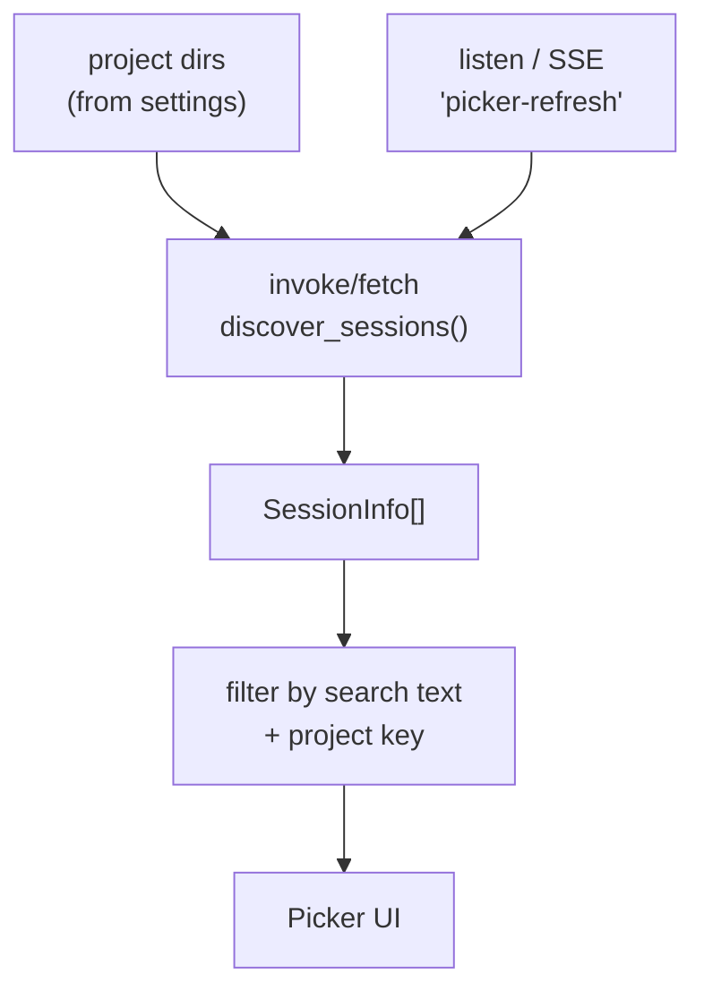

---

### `useKeyboard` — Global Keyboard Handler

Routes key events to the active view. Ignores events targeting `INPUT`, `TEXTAREA`, and
`contentEditable` elements.

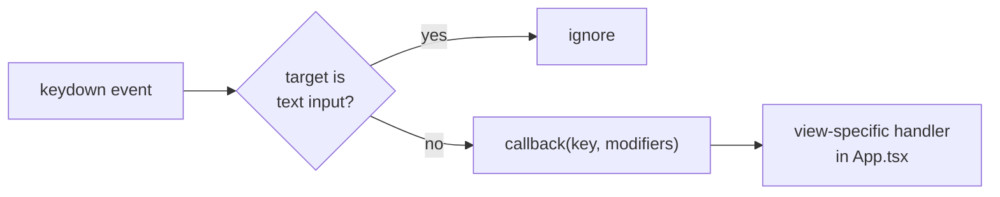

---

### `useAutoScroll` — Smart Auto-Scroll

Auto-scrolls the message list when new messages arrive, but only if the user is near the bottom.

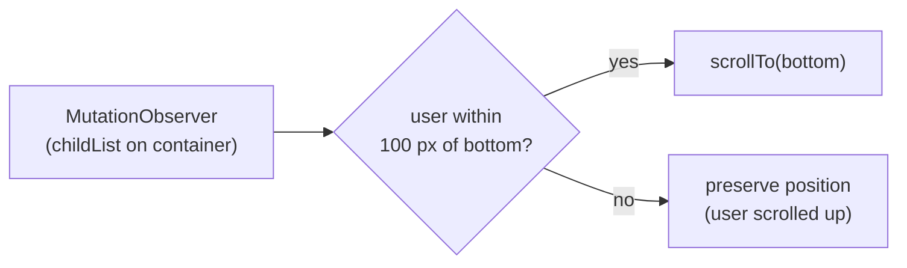

---

### `useScrollToSelected` — Selection Scroll

Scrolls the selected item into view when the selection changes.

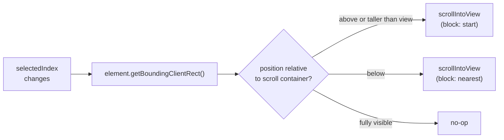

---

### `useViewActions` — Expand/Collapse Delegation

Decouples the toolbar's "Expand All / Collapse All" buttons from the active view component.

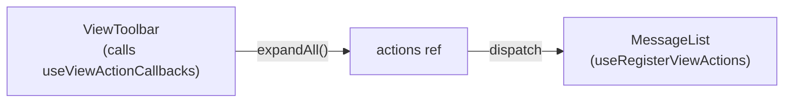

The toolbar holds a stable ref. The active view registers its handlers. When the toolbar fires,
the view's handler executes without a re-render cycle.

---

### `useTauriEvent` — Event Subscription

Generic hook that subscribes to a named Tauri event and calls a handler on each emission.
Handles unlisten cleanup on unmount and AbortController for in-flight async operations.

---

### `useToggleSet` — Expand State

A `Set<number>` backed by React state. Supports:

- `toggle(i)` — flip single index
- `setAll(items)` — expand all
- `clear()` — collapse all

Shared between web and TUI (lives in `shared/hooks/useToggleSet.ts`).

---

## Key Components

### `MessageList` — Virtualized Message Rendering

Renders the message list via `react-virtuoso` (`<Virtuoso totalCount={count}>`) rather than
mapping over a flat array of messages. Rows are rendered from `getMessage(index)`; indices whose
body isn't loaded yet render a lightweight placeholder row sized to approximate a typical loaded
row, so the placeholder-to-content swap causes only a small reflow. Virtuoso's `rangeChanged`
callback drives `useSession`'s `ensureRange(start, end)` so only the visible (plus a viewport
margin) window is fetched.

WebKit does not recompute `:hover` state during virtualized scrolling — since content shifts
under a stationary cursor rather than the cursor moving, a stale hover state can appear "stuck"
on whatever row ends up under the cursor once scrolling stops. `MessageList` works around this by
tracking the last known mouse position and, once Virtuoso reports scrolling has settled, forces a
synthetic `mousemove` event at that position so the browser redoes hit-testing without needing a
real pointer move.

### `MessageDetail` — Multi-Panel Detail View

The most complex component. Shows items from a selected message and supports recursive subagent
drill-down.

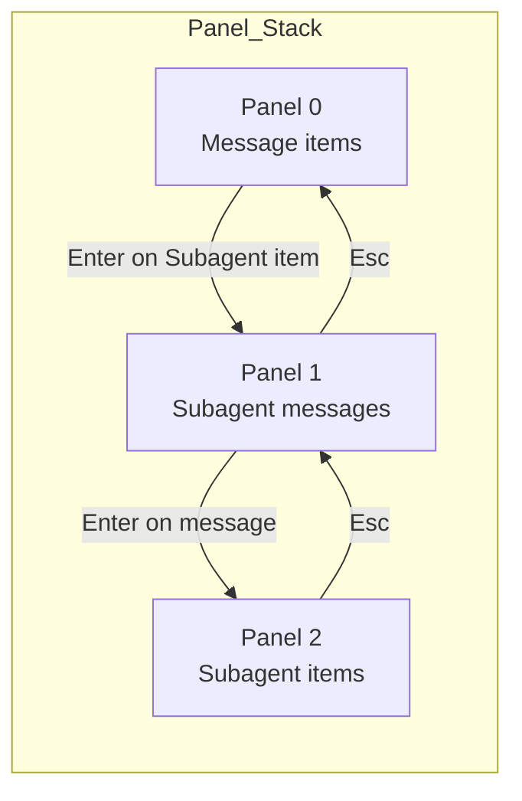

Layout: horizontally resizable two-column split.

- Left column: item list (tools, thinking, outputs)
- Right column: selected item detail (JSON viewer, markdown, etc.)

Keyboard navigation:

- `j/k` — move between items (within focused panel)
- `h/l` — switch left/right panel focus
- `Enter` — drill into subagent
- `Esc/q` — pop panel
- `Tab` — expand/collapse selected item
- `e/c` — expand/collapse all items

---

### `ProjectTree` — Hierarchical Session Browser

Groups sessions by project key, nesting worktree sessions under their parent.

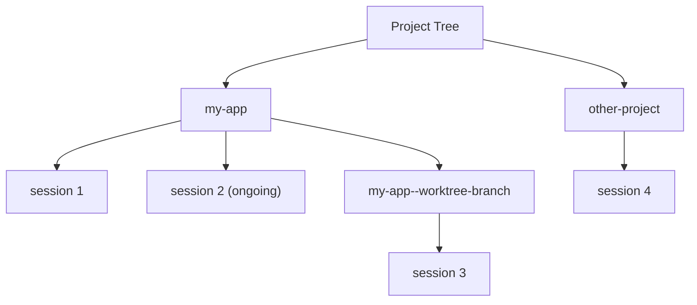

Project key derivation is in `shared/projectTree.ts`:

- Split path by `--` to get hierarchy segments
- Each segment becomes a tree node
- Worktrees become children of the base project

---

### `SessionPicker` — Session List with Search

Displays all sessions grouped by date with token/cost stats.
Supports text search and project filtering (via `ProjectTree` selection).

---

### `InfoBar` — Session Metadata

Top bar showing: project · session_id (8 chars) · git branch · permission mode ·
context % · tokens · cost · ongoing spinner.

Context % uses a colour gradient:

- `< 50%` → green
- `50–80%` → orange
- `> 80%` → red

---

### `DetailItem` — Item Renderer

Renders a single `DisplayItem` with expandable body:

| Item type         | Collapsed preview | Expanded body                 |
| ----------------- | ----------------- | ----------------------------- |
| `Thinking`        | token count       | full thinking text            |
| `Output`          | first line        | full text / markdown          |
| `ToolCall`        | tool_summary      | tool_input JSON + tool_result |
| `Subagent`        | agent type + desc | subagent messages (recursive) |
| `TeammateMessage` | first line        | full text                     |
| `HookEvent`       | hook_name         | key-value pairs + metadata    |

---

## Tauri / HTTP Abstraction

`src/lib/invoke.ts` and `src/lib/listen.ts` provide a unified API that switches
between Tauri IPC and HTTP fetch/EventSource at runtime.

In HTTP mode every call must prove the browser is an accepted client (see
[04-http-api.md — Authentication](04-http-api.md#authentication)). `src/lib/apiToken.ts` holds
the shared token: in `cctrace --web` the `cctrace-api-token` plugin in `vite.config.ts` serves it as
the virtual module `virtual:cctrace-api-token` (`""` in production builds and under vitest, which
stubs it in `vitest.config.ts`); `invoke.ts` sends it as `X-CCTrace-Token` and `listen.ts` appends
`?token=` to the `EventSource` URL. In Docker the value is empty and the server's same-origin cookie
does the job. A 401 rejects with `ApiAuthError`, which `App` shows as a top-level banner instead of
opening Settings. `setApiToken()` notifies `onApiTokenChange` subscribers only when the value really
changes; `listen.ts` subscribes and reopens its stream, so the SSE connection follows the token whether
the rotation came from Settings → Regenerate in this tab or was pushed over HMR because another process
rewrote the file. The dev server is never restarted for a rotation.

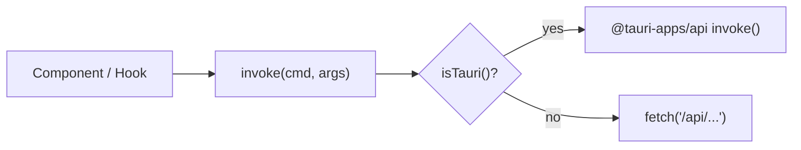

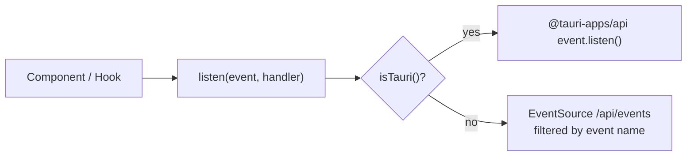

---

## Webview Lifecycle

WebKit (Tauri's macOS webview engine) retains render-tree/layout memory across repeated large DOM
swaps within this long-lived single-page app — physical footprint climbs steadily across
repeated session switches even though JS heap and DOM node counts stay flat. There's no public
WKWebView API to reclaim it, so a full page reload is used as a periodic reset.

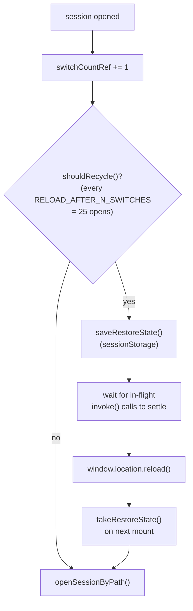

- `src/lib/webviewRecycle.ts` tracks `switchCountRef` in `App.tsx` — how many sessions have been
  opened this page lifetime. Every `RELOAD_AFTER_N_SWITCHES` (25) opens, it saves the current
  session path to `sessionStorage` via `saveRestoreState` and calls `reloadWebview()`.
- `reloadWebview()` waits for `inFlightInvokeCount()` (from `src/lib/invoke.ts`) to reach zero
  (polling with a timeout) before calling `window.location.reload()` — reloading while a Tauri
  IPC call is still pending is a known crash cause on macOS.
- On the next mount, `App.tsx` calls `takeRestoreState()` and, if a pending restore exists, reopens
  that session automatically so the reload isn't disruptive to the user.

---

## Frontend Data Types

All types are defined in `shared/types.ts` and shared with the TUI.
See [07-data-types.md](07-data-types.md) for full type definitions.

---

## Build Configuration

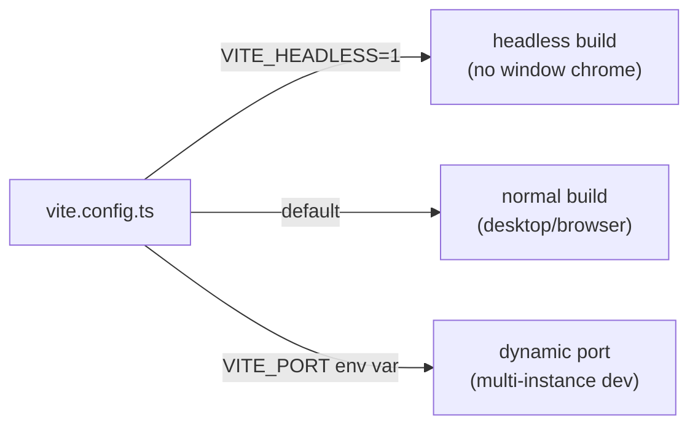

Static assets are served from `dist/` when `CCTRACE_STATIC_DIR` is set in the Rust backend.

---

## Related Specs

- [04-http-api.md](04-http-api.md) — API consumed by this frontend
- [07-data-types.md](07-data-types.md) — shared type system
- [08-session-lifecycle.md](08-session-lifecycle.md) — loading + live update flow
- [13-item-rendering.md](13-item-rendering.md) — per-item rendering details (icons, bodies, expansion)
