# Spec: Terminal UI (TUI)

**Location**: `tui-py/`

The TUI is a Python application built on the [Textual](https://textual.textualize.io/)
framework. It connects to the same Rust HTTP backend as the desktop and web frontends
over `localhost:11423` (`API_BASE` in `tui-py/app.py`). The TUI is the built-in `tui` client:
every request carries its signed credential as an `X-CCTrace-Token` header. `tui-py/auth.py`
reads it from `clients/tui.jwt` in the config dir (written by the backend, never by the TUI) and
`auth_headers()` is re-evaluated per request and per SSE (re)connect, so a `tui` credential
reissued from the Settings UI is picked up without restarting the TUI. A 401 surfaces as
`api.ApiAuthError` naming the file and Settings → Accepted clients. See
[04-http-api.md](04-http-api.md#authentication).

The TUI replaces the earlier React/Ink implementation that lived in `tui/`. The Python
port keeps the same domain types and the same HTTP/SSE contract — only the rendering
layer changed.

---

## Architecture

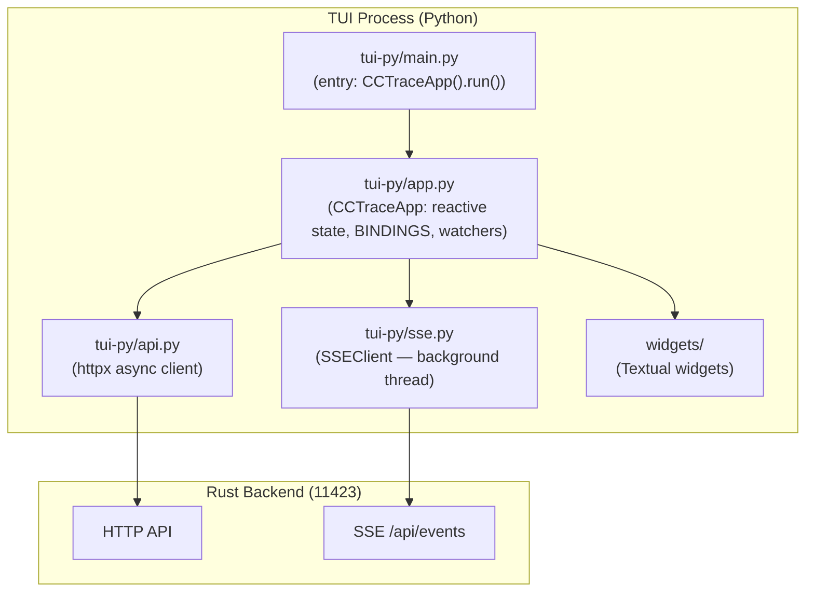

---

## Startup Flow

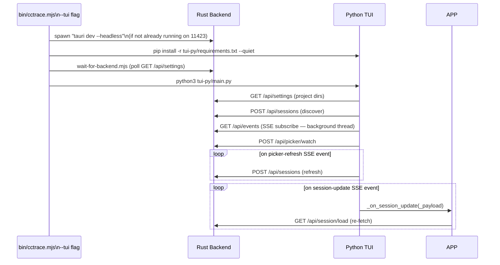

`session-update` is a lightweight refresh signal (message count + roles,
never bodies — see [04-http-api.md](04-http-api.md)). `_on_session_update`
ignores the payload's contents and re-fetches the whole session via
`load_session` instead, so `self.messages` stays authoritative even though
the TUI doesn't paginate the way the web frontend does.

---

## View State Machine

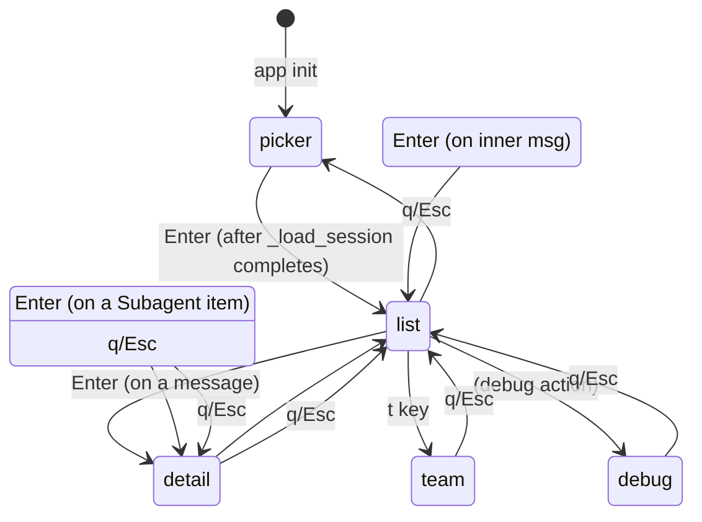

State lives on `CCTraceApp` as Textual reactives:

```
view: "picker" | "list" | "detail" | "team" | "debug"
messages, teams, ongoing, meta, totals, expanded_messages, expanded_items
subagent_item, subagent_detail_msg
```

Each reactive has a `watch_<name>` callback that calls the matching `_sync_<view>`
method to push state into the corresponding widget.

---

## Layout

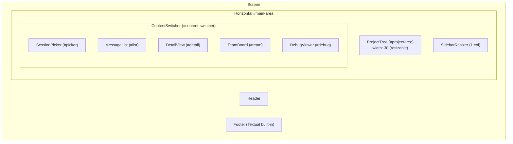

---

## Keyboard Routing

Textual collects bindings from the focused widget chain + App and renders them
in the Footer. Bindings come from two layers:

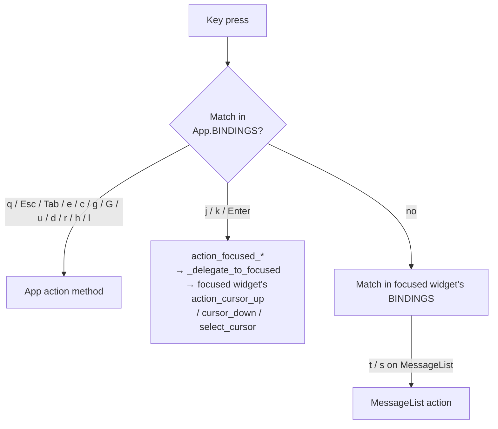

**App.BINDINGS** (in `tui-py/app.py`):

| Key       | Action                            | Description   |
| --------- | --------------------------------- | ------------- |
| `j`       | `focused_cursor_down`             | ↓             |
| `k`       | `focused_cursor_up`               | ↑             |
| `enter`   | `focused_select_cursor`           | Open          |
| `q`       | `back_or_quit`                    | priority=True |
| `escape`  | `back_or_quit`                    | priority=True |
| `tab`     | `toggle_expand`                   | priority=True |
| `e`       | `expand_all`                      | priority=True |
| `c`       | `collapse_all`                    | priority=True |
| `g` / `G` | `jump_first` / `jump_last`        | priority=True |
| `u` / `d` | `scroll_up` / `d_action`          | priority=True |
| `r`       | `refresh`                         | priority=True |
| `h` / `l` | `focus_sidebar` / `focus_content` | priority=True |

Putting `j/k/Enter` at the App level (not on each list widget) ensures they
always render in the Footer. The action methods (`action_focused_cursor_up`,
etc.) call `_delegate_to_focused(name)` which invokes
`action_<name>` on `self.focused`.

---

## Shared list base — `HighlightListView`

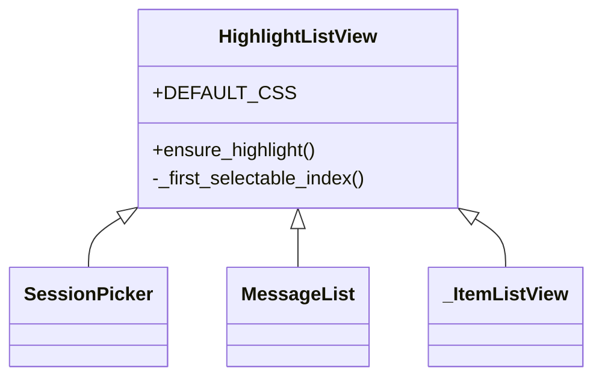

All three list pages extend `HighlightListView` (`widgets/highlight_list.py`).
The base class owns:

- **Highlight CSS** — `ListItem.-highlight` and the focused variant both paint
  with `$block-cursor-blurred-background` (`#0178D44C`). `background-tint`
  on focus is forced to transparent so the focused tint doesn't lighten the
  selection.
- **`ensure_highlight()`** — sets `index` to the first non-disabled child
  if no row is currently highlighted. Idempotent. Skips the disabled
  header/section rows that SessionPicker puts at the top of its list.

This eliminates the bug class where each list page had its own copy of the
highlight CSS / index initialization and fell out of sync when only one was
patched.

---

## Component Inventory

### `SessionPicker` (`widgets/session_picker.py`)

Inherits `HighlightListView`. Groups sessions by date bucket
(Today / Yesterday / This Week / This Month / Older), with disabled header
rows for the bucket title and an aggregate "Sessions (N)" header at the top.

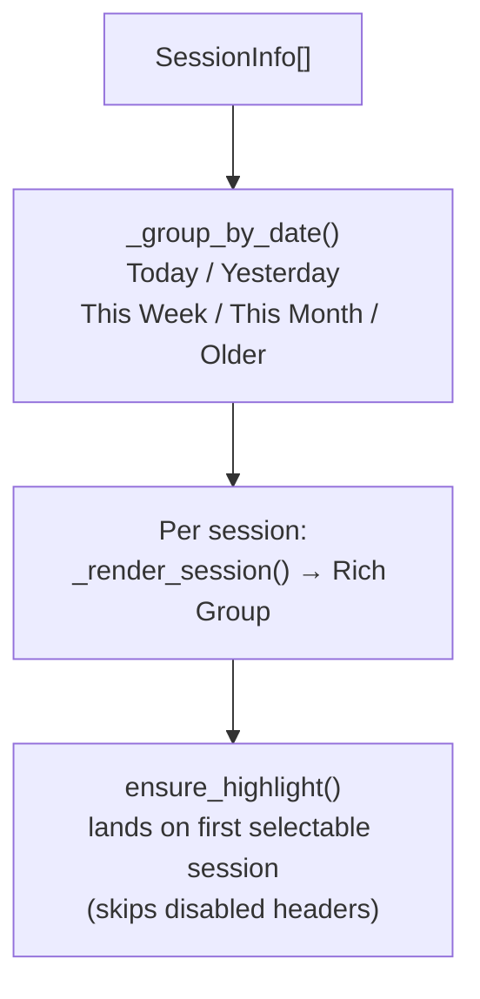

Uses `self.loading = True` (Textual's built-in `LoadingIndicator` overlay)
while discovery / re-discovery is in flight. Loading overlay is also raised
while a session is being loaded — see `_load_session` below.

---

### `MessageList` (`widgets/message_list.py`)

Inherits `HighlightListView`. Renders each `DisplayMessage` as a 3-column
Rich `Table` (accent rail · content · right-aligned stats).

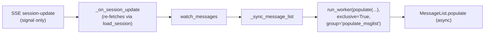

`populate()` is **async** and the caller schedules it in an exclusive worker
group so back-to-back populates serialise. Three branches:

1. **`new_total == 0`** → mount a disabled "No messages loaded" placeholder.
2. **`old_total == 0` or `node_count != old_total`** → full rebuild
   (`await self.clear()` then `await self.append(...)` per row),
   followed by `ensure_highlight()`.
3. **Otherwise** → incremental diff: refresh only the rows whose content or
   expansion state changed; append new tail rows; remove dropped tail rows.

> Historical bug: an earlier sync `populate` raced with its own deferred
> `clear()/append()` calls (both return `AwaitComplete`) so rapid back-to-back
> populates (`self.messages = []` then `= real` during `_load_session`)
> produced 27 / 53 children for 26 messages and the deferred `clear()` later
> snapped the index back to `None`. The async + exclusive-worker design fixes
> the race; the incremental diff path preserves the user's cursor through SSE
> updates.

---

### `DetailView` (`widgets/detail_view.py`)

Pane that opens when the user presses Enter on a message in `MessageList`.
Wrapped in a single bordered container (`border: round $border`) so the
header and items list read as one panel.

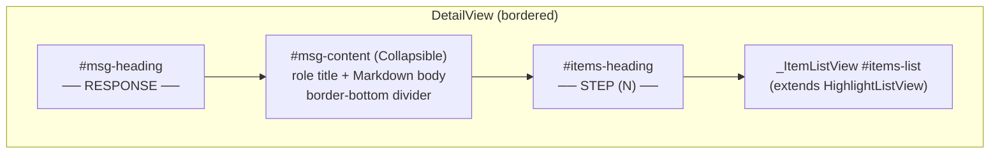

`populate()` classifies the call:

- If `prev_items == new_items` (only an expansion bit flipped) →
  `_sync_expanded_only()` walks each `#item-N` Collapsible and updates
  `collapsed` in place. **The ListView is never cleared**, so `lv.index`
  keeps the user's cursor where it was.
- Otherwise → eager synchronous clear of **`#items-list` only**, set
  `self.loading = True`, schedule `_rebuild` via `call_after_refresh`.
  `_rebuild` mounts the new message body + items list and clears
  `self.loading` in a `finally` block. `#msg-content` (the message-header
  Collapsible) is deliberately left untouched here — the `LoadingIndicator`
  already covers the whole pane, and emptying a `Collapsible`'s children
  makes Textual treat it as a non-container, so `Widget.render()` falls
  back to printing its raw CSS identifier
  (`Collapsible#msg-content.-collapsed`) for one frame before `_rebuild`
  remounts real content.

Headings:

- `#msg-heading` shows `── RESPONSE ──` when a message is selected, hidden
  otherwise.
- `#items-heading` shows `── STEP (N) ──` with the live item count; hidden
  when the message has no items.

### On-demand full message fetch

`self.messages` (from `load_session`) has `tool_input` / `tool_result` /
`tool_result_json` stripped on every item, to keep the list view light — the
same light/full split the web frontend uses (see
[08-session-lifecycle.md](08-session-lifecycle.md)). Opening Detail on
message `idx` doesn't index into `self.messages`; instead
`_sync_detail_view_for_message_index`:

1. Clears `self._detail_full_message` and calls `_sync_detail_view()` so the
   pane shows its loading state, not stale data from the previous message.
2. Kicks off `_fetch_detail_message(path, idx)` in an exclusive worker
   (`group="load_detail_message"`), which calls `POST /api/session/message`
   via `api.load_message` and stores the full `DisplayMessage` on
   `self._detail_full_message`.
3. The fetch guards against staleness: if the session, message index, or
   view changed while the request was in flight, the result is discarded.

`_active_detail_message()` returns `self._detail_full_message` (or the
subagent detail message when drilled into one) rather than indexing
`self.messages`. Leaving Detail (`action_back_or_quit`'s top-level branch)
clears `self._detail_full_message` so the heavy body isn't held after the
view switches back to the list.

### Item body rendering by type

| `item_type`       | Body content                                                                                  |
| ----------------- | --------------------------------------------------------------------------------------------- |
| `Thinking`        | scrollable Markdown                                                                           |
| `Output`          | pretty-printed JSON or Markdown                                                               |
| `ToolCall`        | unboxed "Input"/"Result" label + boxed, wrapped JSON (`Edit` renders a coloured diff instead) |
| `Subagent`        | agent ID, desc, prompt, last result                                                           |
| `TeammateMessage` | plain text                                                                                    |
| `HookEvent`       | hook name inline, then unboxed "cmd"/"metadata" labels + boxed JSON                           |

`ToolCall`/`HookEvent` JSON used to render as Markdown fenced code blocks,
whose `MarkdownFence` widget forces `overflow: scroll hidden` — long lines
scrolled horizontally instead of wrapping. They now render via
`textual.highlight.highlight()` (the same tokenizer Markdown uses
internally) inside a plain `Static.diff-block`, which wraps at the pane
width like the web UI's JSON viewer while keeping JSON syntax colours.

The "Input"/"Result"/"cmd"/"metadata" labels are a separate unbordered
`Static.item-label`, not a `Markdown` widget — `_ItemListView`'s CSS borders
every `Markdown` widget, so a `Markdown("**Input**")` label used to get its
own tiny bordered box above the content box. Only `Static.diff-block` (the
JSON/diff content itself) is boxed now.

---

### `ProjectTree` (`widgets/project_tree.py`)

Sidebar showing project hierarchy with expand/collapse. Uses Textual's
built-in `Tree`. Highlight is `$accent 50%` on `.tree--cursor`.

Keyboard navigation:

- `h` / `l` — focus sidebar / content pane (App-level)
- `j` / `k` — navigate tree nodes (App-level delegates to focused Tree)
- `Space` — expand/collapse a group node
- `Enter` — select a project (filter sessions)

---

### `InfoBar` (`widgets/info_bar.py`)

```
┌────────────────────────────────────────────────────────────────┐
│ my-app · abc12345 · * main · default │ 45.2% · 8.3k · $0.03 ● │
└────────────────────────────────────────────────────────────────┘
```

Context percentage colour:

- `< 50%` → accent blue
- `50–80%` → orange
- `> 80%` → red

---

## Session loading flow

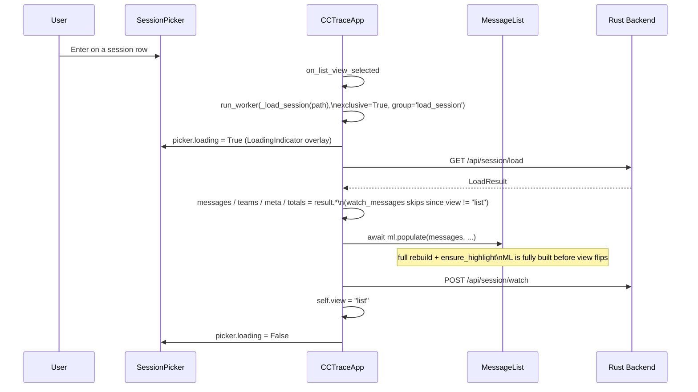

The view flips to `"list"` **only after** `MessageList` is fully populated.
This avoids the "j/k does nothing for a couple of seconds" window where the
user lands on a half-built list pane.

---

## SSE integration (`tui-py/sse.py`)

`SSEClient` is a thin httpx-based client running on a background thread.
It maintains a per-event handler dict and dispatches each `event:` /
`data:` pair to the registered async handler via `app.call_from_thread`.

Subscribed events:

- `picker-refresh` — re-runs `api.discover_sessions(dirs)`.
- `session-update` — a lightweight signal (count + roles, no bodies, see
  [04-http-api.md](04-http-api.md)). Calls `_on_session_update(_payload)` on
  the App, which ignores the payload and re-fetches the session via
  `load_session`, then updates `messages` / `teams` / `ongoing` / `meta` /
  `totals` from the fresh result and calls `_sync_all_widgets()`. If the
  re-fetch raises (backend momentarily unreachable), the previous
  `self.messages` is left untouched rather than cleared.

---

## Theme (`tui-py/theme.py`)

Maps domain roles to Rich/Textual colour tokens. Same colour palette as the
previous Ink implementation (Primary text `#d0d0d0`, accent Claude `#5fafff`,
Opus `#ff5f87`, Sonnet `#5fafff`, Haiku `#87d787`, Ongoing `#5faf00`,
Token-high `#ff8700`, Error `#ff0000`, Thinking `#767676`, Tool `#5fafff`,
Agent `#5fafaf`, Hook `#ffdf00`).

The CSS lives in `tui-py/cctrace.tcss` and is loaded via `App.CSS_PATH`. The
file is intentionally small — most per-widget styling sits in `DEFAULT_CSS`
on the widget class. The shared highlight rules live on `HighlightListView`,
not duplicated in the global CSS.

---

## Tests (`tui-py/tests/`)

`pytest` + `pytest-asyncio` (configured in `pytest.ini`).

| File                        | Covers                                                                                                                                                                           |
| --------------------------- | -------------------------------------------------------------------------------------------------------------------------------------------------------------------------------- |
| `test_highlight_list.py`    | `ensure_highlight` policy, disabled-row skipping, idempotence, shared highlight color resolves to `$block-cursor-blurred-background`.                                            |
| `test_message_list.py`      | Async populate race-safety (no duplicated rows after empty→real), full-rebuild sets index=0, incremental diff preserves the user's cursor, tail append, empty-state placeholder. |
| `test_detail_view.py`       | Bordered container, RESPONSE/STEP headings render with live counts and hide when there is no message / no items; "Input"/"Result" label is unboxed while the JSON content is.    |
| `test_message_from_dict.py` | `message_from_dict` (the `POST /api/session/message` response parser) parses top-level fields, full tool_input/tool_result bodies on items, and nested subagent messages.        |
| `test_load_message.py`      | `api.load_message` posts `{path, index}` to `/api/session/message` and returns `None` for an out-of-range index.                                                                 |
| `test_session_update.py`    | `_on_session_update` re-fetches via `load_session` on the lightweight signal, is a no-op with no session open, and keeps prior messages when the re-fetch fails.                 |

Run with:

```bash
cd tui-py && python -m pytest tests/
```

---

## Build & Distribution

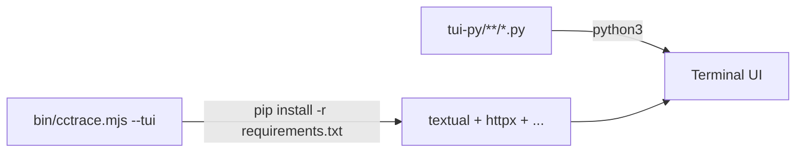

No build step — the source is run directly with the system Python (3.11+).
`pip install -r tui-py/requirements.txt` installs runtime dependencies on
first launch.

---

## Related Specs

- [04-http-api.md](04-http-api.md) — API consumed by the TUI
- [05-frontend-web.md](05-frontend-web.md) — web frontend sharing same types
- [07-data-types.md](07-data-types.md) — shared type system
- [08-session-lifecycle.md](08-session-lifecycle.md) — light/full message split, session-update signal
- [12-cli-launcher.md](12-cli-launcher.md) — `--tui` backend spawn/kill lifecycle
- [13-item-rendering.md](13-item-rendering.md) — per-type item rendering
